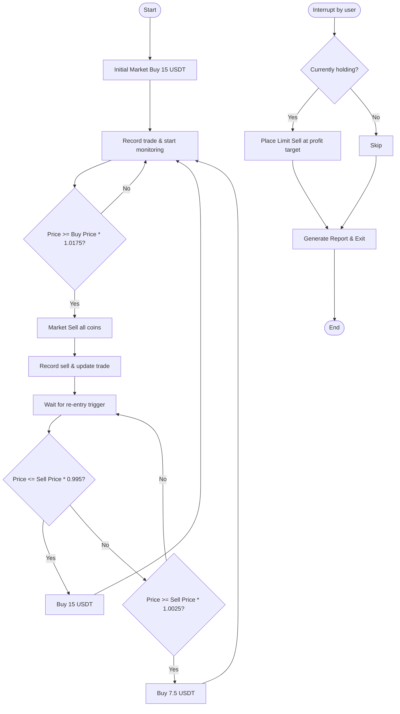

# 🤖 Bit24 Spot Trading Bot

> **Live version available in the [`/real`](./real) folder**  
> This repository contains both a **demo** (for testing logic) and the **production-ready** bot for the Bit24 exchange.  
> The demo uses a local mock API – the real code connects to the live Bit24 API (credentials required).

---

## 📌 Overview

This is an **automated spot trading bot** designed for the **Bit24 exchange**.  
It trades a single cryptocurrency pair (e.g., `BTC/USDT`) using a **mean-reversion + profit‑target** strategy.

### Core Features

- **Market orders** for quick execution (buy/sell)
- **Profit target** of **+1.75%** per trade (sell when price rises that much)
- **Smart re‑entry** after each sell:
  - Buy **15 USDT** if price **drops 0.5%** from the sell price
  - Buy **7.5 USDT** if price **pumps 0.25%** from the sell price
- **Fee handling** – accounts for 0.55% trading fee per order
- **Trade logging** – saves every order to `trade.json`
- **Balance monitoring** – records USDT value every 5 seconds
- **Report generation** – creates an HTML report with a balance chart and statistics

---

## 🔄 How It Works

The bot runs in an infinite loop:

1. **Initial buy** – buys **15 USDT** worth of the chosen coin.
2. **Hold** – monitors the price until it reaches the **profit target** (+1.75% above the buy price).
3. **Sell** – executes a market sell for the entire coin balance.
4. **Wait for re‑entry** – after selling, it watches the price:
   - If price **drops 0.5%** from the sell price → buy **15 USDT**
   - If price **pumps 0.25%** from the sell price → buy **7.5 USDT**
5. **Repeat** – go back to step 2 with the new buy price.

On **Ctrl+C** (graceful shutdown):
- If holding coins, it places a **limit sell** at the profit target price.
- Generates a final report with all trades and the balance chart.

---

## 📊 Flowchart



---

## 📁 Folder Structure

```
/
├── README.md               # This file
├── real/                   # Production‑ready code (connects to live Bit24 API)
│   └── bot.py              # Real implementation with actual API endpoints
├── demo/                   # Demo version for testing (uses localhost:3001)
│   └── bot.py              # Demo code with mock endpoints
├── change-logs/            # Version history and updates
│   └── CHANGELOG.md
└── old-codes/              # Archived previous versions-{release code}
    └── ...
```

---

## 🧪 Demo vs. Real

| Aspect               | Demo (`/demo`)                                   | Real (`/real`)                                   |
|----------------------|--------------------------------------------------|--------------------------------------------------|
| **API Base URL**     | `http://localhost:3001` (mock server)            | Actual Bit24 API endpoints or another exchange                       |
| **Authentication**   | Any token (not validated)                        | Requires a valid API token                 |
| **Order execution**  | Simulated (returns dummy success)                | Real market/limit orders on Bit24 or another exchange                 |
| **Purpose**          | Test logic, strategy, and report generation      | Live trading with real funds                     |
| **Risk**             | No financial risk                                | **Use at your own risk** – real money involved   |

> **Always test thoroughly with the demo before running the real bot!**

---

## 📈 Example Run

Here’s a typical session:

```
Enter symbol (e.g., BTC): BTC
Enter API token: your_token_here

Starting perpetual bot...
Profit target: +1.75%
Buy triggers after sell: drop 0.5% (15 USDT) or pump 0.25% (7.5 USDT)
Trading fee: 0.55% per trade

Placing initial buy order...
Buy done: 0.000123 BTC @ 45000.000000
Fee (0.55%): 0.0825 USDT, net spent: 14.9175 USDT

Holding 0.000123 BTC, waiting for +1.75% profit...
price >= 45787.500000 (profit target)
Profit target reached at 45790.000000!
Selling 0.000123 BTC...
Sell successful at 45790.000000
Gross: 5.6322 USDT, Fee: 0.0309 USDT, Net: 5.6013 USDT

Waiting for buy trigger:
  Drop 0.5% to <= 45561.050000 -> buy 15 USDT
  Pump 0.25% to >= 45904.475000 -> buy 7.5 USDT
...
```

(After some time, the bot repeats the cycle.)

---

## 🛑 Graceful Shutdown

Press `Ctrl+C` at any time. The bot will:

- If holding a position, place a **limit sell** at the profit target price.
- Record the final balance.
- Generate `trade_report.html` and `balance_chart.png` in the current directory.

---

## 📄 Reports

- **`trade.json`** – Full history of all orders (buy and sell) with timestamps, prices, amounts, and statuses.
- **`trade_report.html`** – User‑friendly summary with:
  - Start / end balance
  - Total profit / loss (USDT and %)
  - Total number of trades
  - Total fees paid
  - Balance chart over time (line plot)

---

## ⚙️ Configuration (tunable parameters)

All parameters are set at the top of the bot script:

| Parameter | Value | Description |
|-----------|-------|-------------|
| `BUY_AMOUNT_USDT` | 15 | Standard buy amount after a drop |
| `PUMP_BUY_AMOUNT_USDT` | 7.5 | Reduced buy amount after a pump |
| `PROFIT_THRESHOLD` | 0.0175 (1.75%) | Sell when price rises this much |
| `DROP_THRESHOLD` | 0.005 (0.5%) | Trigger a 15 USDT buy on this drop |
| `PUMP_THRESHOLD` | 0.0025 (0.25%) | Trigger a 7.5 USDT buy on this pump |
| `FEE_RATE` | 0.0055 (0.55%) | Trading fee applied to each order |
| `BALANCE_RECORD_INTERVAL` | 5 seconds | How often to record balance |

---

## 🔐 Security & Disclaimer

- The **real** bot interacts with the Bit24 exchange using your API token.  
  **Keep your token secret** – never commit it to version control.
- This software is provided **as‑is**, without warranty.  
  **Cryptocurrency trading involves substantial risk**; you are solely responsible for any financial losses.
- Always test with small amounts or on the demo first.

---

## 📝 License

[MIT](LICENSE) – feel free to use and modify, but **no liability** is accepted.

---

## 📬 Questions?

Open an issue or refer to the [change‑logs](./change-logs) for version updates.

Happy trading! 🚀
